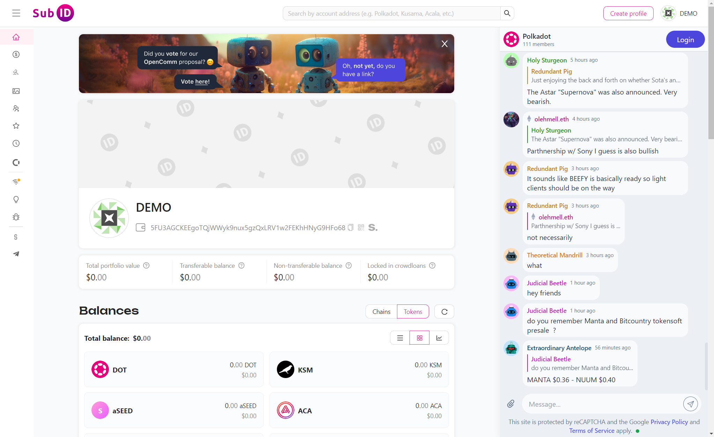
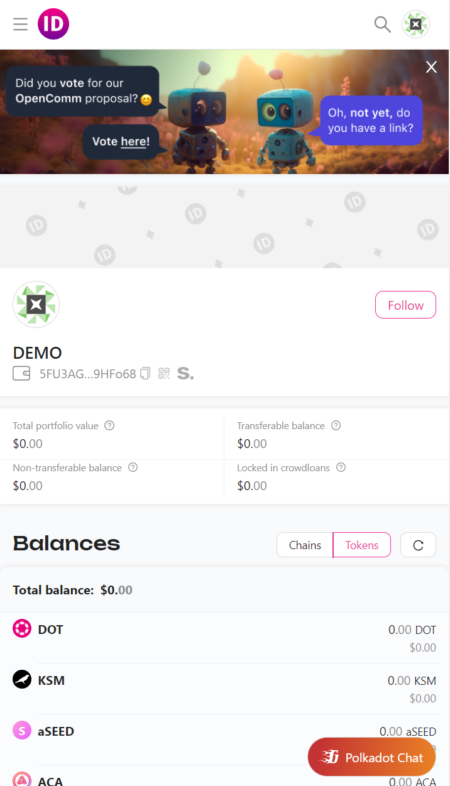
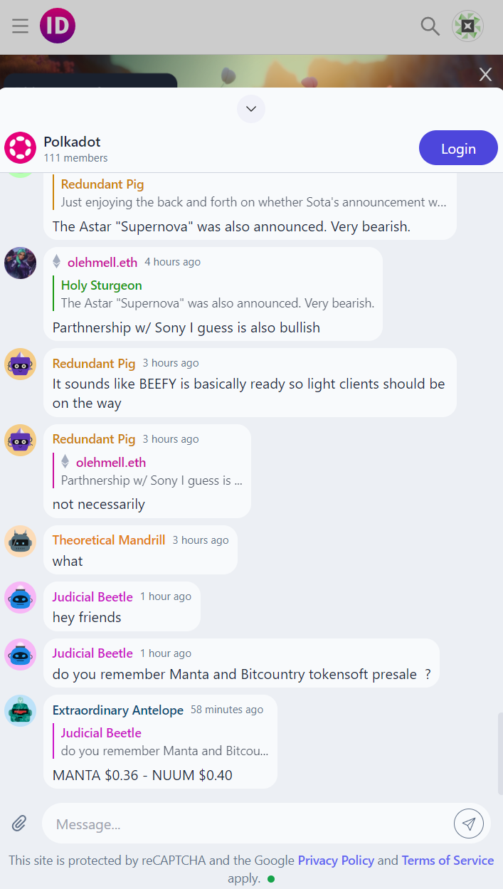
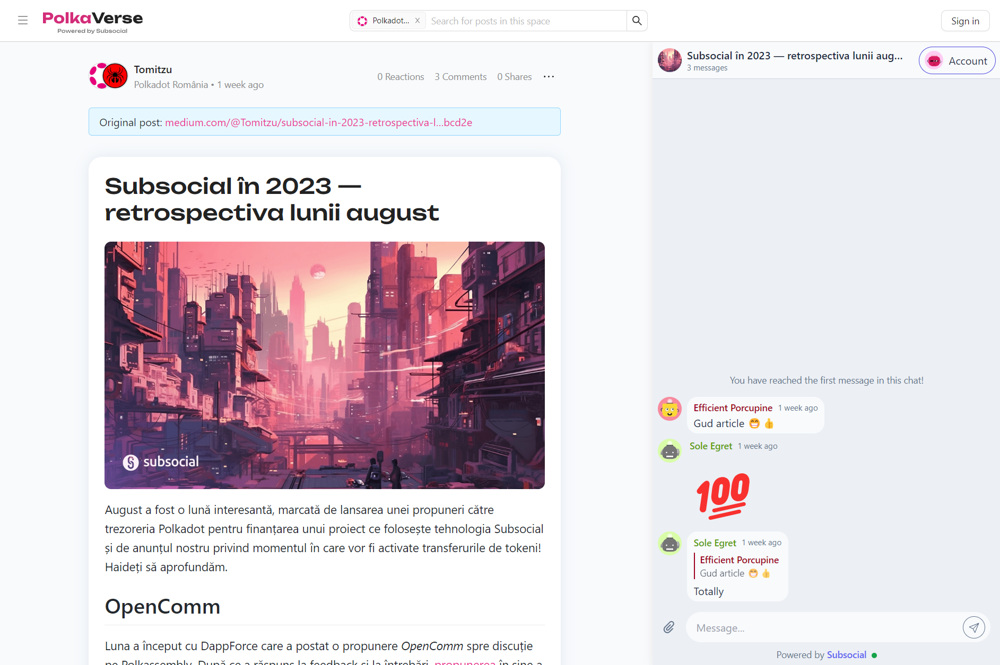
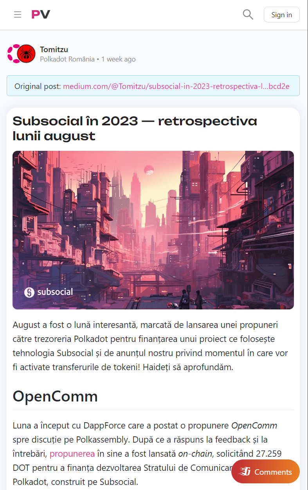
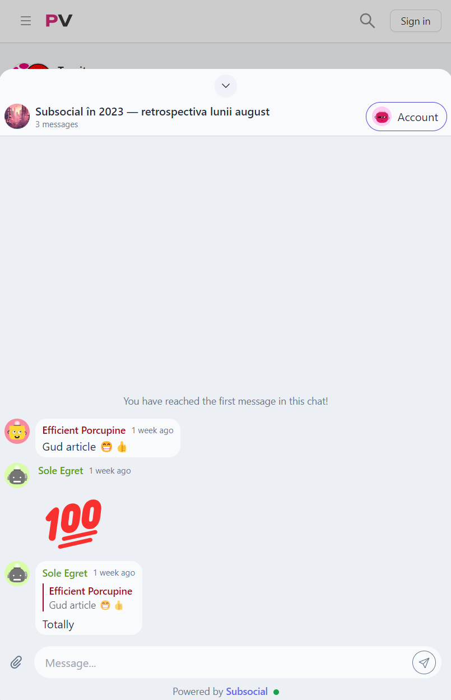

# Example Integrations

1. Sub ID
   | Desktop | Mobile | Mobile (open) |
   | -------------------------------------- | ------------------------------------ | ---------------------------------------------- |
   |  |  |  |
   | -------------------------------------- | ------------------------------------ | ---------------------------------------------- |

   Sub ID is using Grill.chat as simple chat system for whole polkadot ecosystem for their [website](https://subid.io).

   Code: <https://github.com/dappforce/subid/tree/main/src/components/chat>

2. Polkaverse
   | Desktop | Mobile | Mobile (open) |
   | -------------------------------------- | ------------------------------------ | ---------------------------------------------- |
   |  |  |  |
   | -------------------------------------- | ------------------------------------ | ---------------------------------------------- |
   Polkaverse is using Grill.chat as their comments system. You can see it in action [here](https://polkaverse.com).

   Code: <https://github.com/dappforce/polkaverse/tree/main/src/components/chat>
