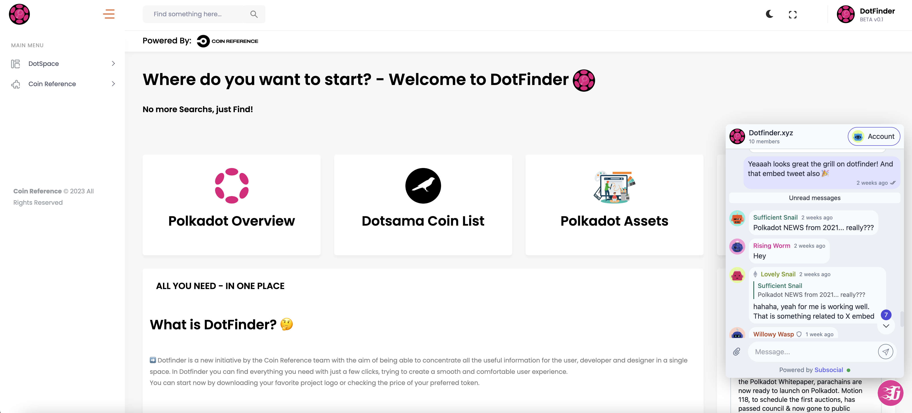
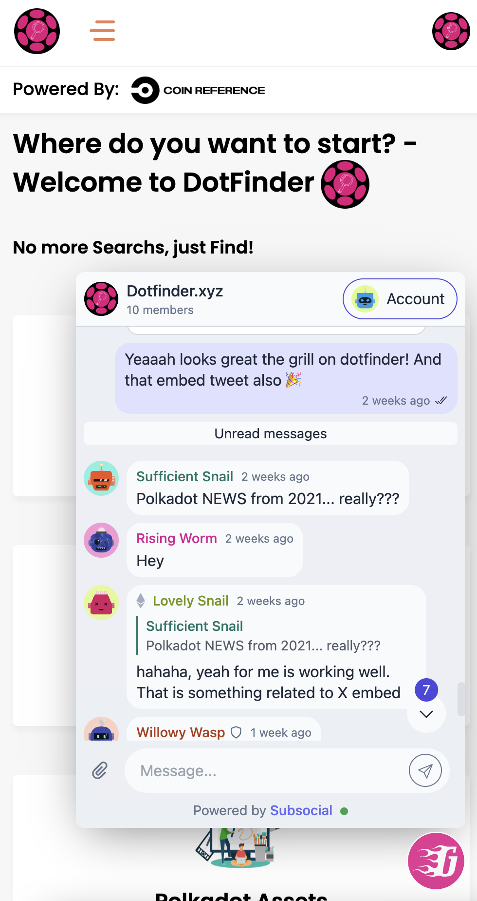

# Example Integrations

1. Sub ID
   | Desktop | Mobile | Mobile (open) |
   | -------------------------------------- | ------------------------------------ | ---------------------------------------------- |
   |  |  |  |

   Sub ID is using Grill.chat as simple chat system for whole polkadot ecosystem for their [website](https://subid.io).

   Code: <https://github.com/dappforce/subid/tree/main/src/components/chat>

2. Dotfinder.xyz
   | Desktop | Mobile |
   | -------------------------------------- | ------------------------------------ |
   |  |  |

   From Dotfinder you can discuss the Polkadot and Kusama ecosystem while searching for your favorite information directly from Grill Chat and from the [website](https://dotfinder.xyz).

   Code: <https://github.com/dappforce/grillchat/tree/main/integration/examples/dotfinder>
